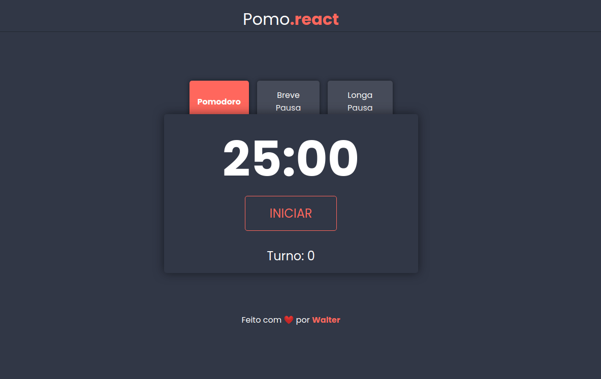
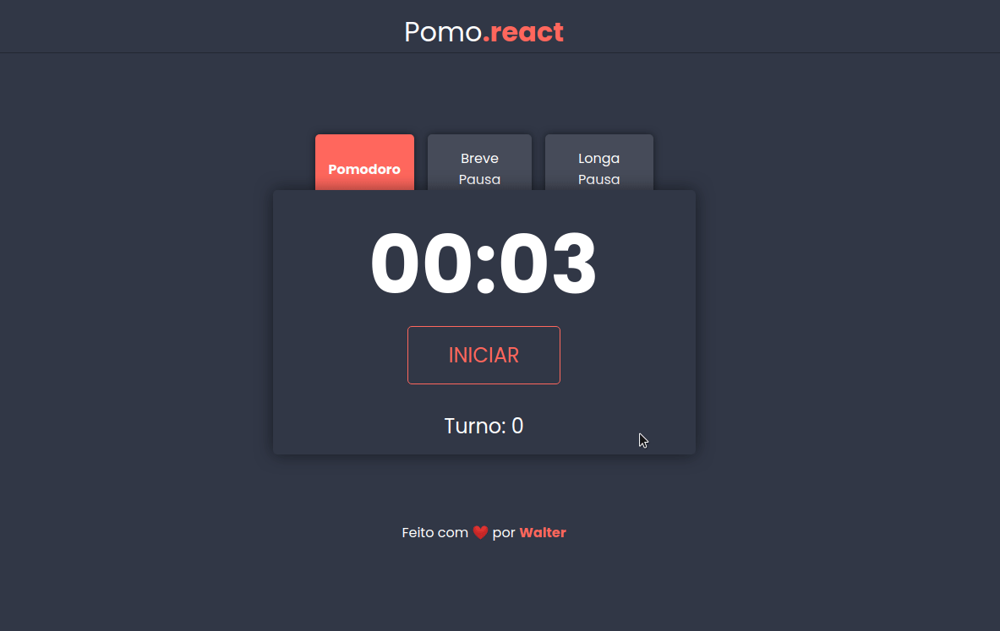

# Pomo.react

<h2 align="center">
🚀 Work in progress...
</h2>

 

### Demonstration

### 🛠 Technologies

---

- [CSS](https://www.w3schools.com/Css/)
- [React.js](https://reactjs.org)
- [JavaScript](javascript.com/)

### Author

---

<a href="https://www.linkedin.com/in/walteralcantara">
    
     
    <b>Walter Alcantara</b>
 </a>

  

